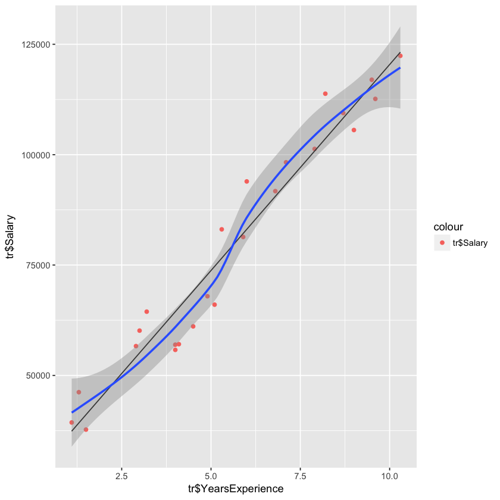

# first post test


```R
library(caTools)
df<- read.csv("Salary_Data.csv")
head(df)
splt<- sample.split(df$YearsExperience,.8)
tr<-subset(df,splt)
ts<-subset(df,!splt)
```


<table>
<thead><tr><th scope=col>YearsExperience</th><th scope=col>Salary</th></tr></thead>
<tbody>
	<tr><td>1.1  </td><td>39343</td></tr>
	<tr><td>1.3  </td><td>46205</td></tr>
	<tr><td>1.5  </td><td>37731</td></tr>
	<tr><td>2.0  </td><td>43525</td></tr>
	<tr><td>2.2  </td><td>39891</td></tr>
	<tr><td>2.9  </td><td>56642</td></tr>
</tbody>
</table>


```R
mod<- lm(Salary~.,tr)
pred<- predict(mod,ts)
ts$predicted<- pred
ggplot(tr,aes(tr$YearsExperience,tr$Salary))+geom_point(aes(color='tr$Salary'))+ geom_line(aes(tr$YearsExperience,predict(mod,tr)))+ stat_smooth()
err<- (ts[[2]]-ts[[3]])
rmse<- sqrt(mean(err^2))
rmse/min(ts[[2]])
```

    `geom_smooth()` using method = 'loess'


0.10306396622709




%%bash
present untitled3

```R
and go 1
```


```R
and go 2
```

